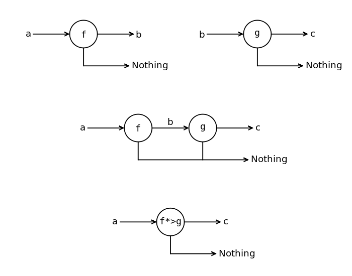
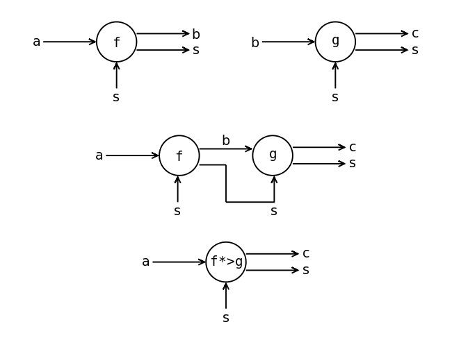
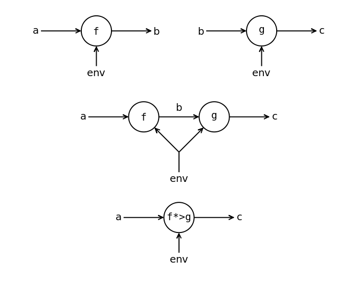
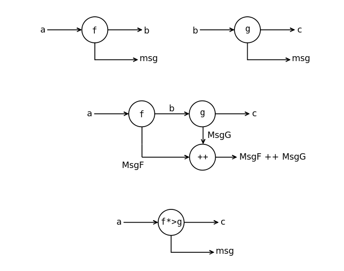

## Notes

- Function's mutual recurtion in combination with pattern matching
  is an exelent way to write _state machines_.

- To use monadic parser **left recursion** should be eliminated.

## Kleisli Composition Operator for Monads

`>=>` (also `*>` is used) is really just a function composition, but `>>` wouldn't work here since
the return type of the first function isn't the argument of the second one - it
is wrapped in a `Result<'t>` and needs to be unwrapped, which is exactly what
`>=>` implementation does.

```
let (>=>) f1 f2 arg =
    f1 arg >>= f2
```

Here is graphically:

### Maybe



### State



### Reader



### Writer


